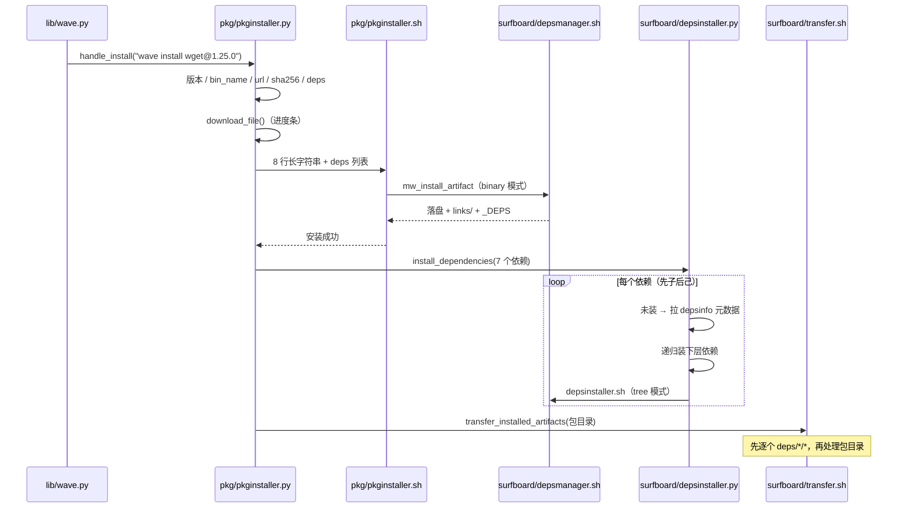

# 🌊 MacWave 项目结构

面向 macOS / Linux 软件开发者的包管理器，主要托管 iOS/iPadOS 相关软件包。
技术栈：Python + Shell。

- `main` 与版本分支（当前的 `2.4`）：程序代码，两者保持同步
- `configdata` 分支：版本数据（`versiondata/latest_version` 给 `wave selfupdate` 判断有没有新版本，`versiondata/files_info` 是要更新的文件清单）
- `infosource` 分支：纯数据（包与依赖的元数据、下载地址、校验值）

---

## 一、仓库目录

```
lib/          入口与帮助
pkg/          安装与查询核心
surfboard/    依赖处理
scripts/      回归测试脚本
.github/      CI
.templates/   目录与文件的模板样例（bin/、pkg/、macwave_config/）
.Pseudocode/  早期伪代码，仅作参考
STYLE.md      代码风格约定
README.md     用户文档
```

## 二、各文件作用

### lib/ —— 入口与帮助

| 文件 | 作用 |
| --- | --- |
| `wave.py` | 主入口。读配置目录（`config.json`）的 `base_dir`，把 `lib/`、`pkg/`、`surfboard/` 注入 `sys.path`；用 `COMMANDS` 字典把 `install / uninstall / list / search / info / version / selfupdate / link / unlink / linkquery` 分发到对应模块，`ARGUMENTS` 处理 `-h/--help/-V/--version` |
| `configpaths.py` | **配置目录解析**（`find_config_dir` / `load_base_dir` / `CONFIG_FILE` / `VERSION_FILE`）：系统级 `/opt/macwave_config` 优先，其次用户级 `~/.config/macwave_config`；系统级配置损坏或缺 `base_dir` 时也回落用户级。其余模块都从这里取配置，不再各自写死路径 |
| `configerror.py` | 启动前的环境自检：只要两处配置目录里有一处装了 MacWave 就放行；都没装且在 git 仓库里时，报错并提示用 `lib/install.sh` 正式安装 |
| `help.py` | 帮助与版本文本：`print_custom_help`（`-h` / `--help` 的用法，命令与旗标列表与 README 的 Command Reference 对齐）、`print_version`、`print_error_help`（未知命令时先报错再打帮助） |
| `install.sh` | 官方安装脚本：选安装目录、`sudo` 提权、建运行时目录（`bin` / `links` / `deps` / `pkg` / `surfboard` / `lib` / `downloads/tmp`）、写 `config.json` / `VERSION.json`（**系统目录→`/opt/macwave_config`，用户目录→`~/.config/macwave_config`**）、**用户级安装时把 2.5 之前的旧系统级配置 `/opt/macwave_config` 迁走**（否则它会因系统级优先而盖住新配置）、**按 configdata 的 `versiondata/files_info` 清单拉取全部程序文件**（与 `selfupdate.sh` 共用同一份清单，解析逻辑也相同）、安装 Python 依赖（requests / packaging / rich）、把 `bin/` + `links/` + `lib/` 写入 PATH（升级时替换旧版只含 `bin`/`lib` 的行）、清理旧版平铺 `bin/` 文件、检查 Xcode 命令行工具（`otool` / `install_name_tool` / `codesign`）、许可协议确认（直接回车视为同意）。注意 `MACWAVE_VERSION` 仍**按分支写死**在脚本里，不能从 configdata 取 —— 否则用旧分支安装会写成新版本号 |
| `uninstall.sh` | 卸载 MacWave 本体：读两处配置定位 `BASE_DIR`（都读不到则遍历候选路径）、二次确认后删除安装目录与两处配置目录、清掉 rc 文件里的 PATH 行、最后自删 |
| `selfupdate.py` | `wave selfupdate`：拉 `configdata` 分支的 `versiondata/latest_version`，取其 `version` 与当前生效的 `VERSION.json` 比较（只比数字段，`2.3` == `2.3.0`）；已是最新则直接返回，否则把 `update_command` 中 `<<<` / `>>>` 之间的内容交给 `/bin/bash -c` 执行（用环境变量 `MACWAVE_UPDATE_VERSION` / `MACWAVE_UPDATE_BRANCH` 把目标版本与分支传下去）。因为 `bash -c "$(curl …)"` 在 curl 失败时仍返回 0，执行完会**回读 `VERSION.json` 复核**，没变就报错 |
| `selfupdate.sh` | 自更新脚本，由 `latest_version` 的 `update_command` 调用（也可 `bash lib/selfupdate.sh [分支]`）：按「系统级 → 用户级」定位配置目录与 `BASE_DIR` → 拉 `configdata/versiondata/files_info`（一份**只写仓库路径**的缩进树，`/` 开头是安装根、以 `/` 结尾表示目录、`#` 开始是注释；缩进每层 4 空格，Tab 与之等价，也可行内直接写 `pkg/linker.py` 这样的完整路径）→ **用脚本内置的 `python3` 解析它**（不能做成单独的 `.py` 文件，否则新文件本身又得先被下载 —— 鸡生蛋）→ 逐个从 `$BRANCH` 下载并复位可执行位（`lib/wave.py` 特例装成可执行的 `lib/wave`；其余 `*.sh` 加 +x）→ 清掉 `__pycache__` → 重写 `VERSION.json`。**以后新增文件只改 configdata 的 files_info，不用再动本脚本** |

### pkg/ —— 安装与查询核心

| 文件 | 作用 |
| --- | --- |
| `pkginstaller.py` | **软件包安装编排**。解析参数（包名取第一个非 flag 的 token，`--limit-rate` / `--proxy` 的值会被跳过）与架构 → 定版本（`@版本`、`--ver` 或远程取最高）→ 拉 `_包名@common` 取 `bin_name` → 拉版本文件取 `url` / `sha256` / `deps` → 下载（rich 进度条、断点续传、限速、代理、30 秒超时+重试询问）→ 调 `pkginstaller.sh` → 通过 `depsinstaller` 递归安装依赖 → 最后调 `linker.link_package()` 把不带版本号的软链接指到刚装好的版本（`--unlink` 可跳过） |
| `pkginstaller.sh` | **软件包安装入口（binary 模式）**：组装长字符串，调用通用安装核心 `depsmanager.sh` 的 `mw_install_artifact`，写 `installed.json`，输出安装结果 |
| `pkginfohelper.py` | `list`（扫描 `bin/` 下的目录）、`search`（远程匹配包名）、`info`（本地已装版本 + 远程可装版本 + `@common` 描述） |
| `pkgversionparser.py` | 版本号比较与排序；处理 `alpha/beta/rc` 预发布，以及 `procursus` / `macwaveteam` / `Xteam` 等特殊版本 |
| `pkgunzip.sh` | 按扩展名解压：`zip` / `tar.gz` / `tar.bz2` / `tar.xz` / `tar` / `gz` / `bz2` / `xz` / `conda`。裸 `xz` 用 Python 标准库 `lzma`（macOS 不自带 `xz` 命令）；**`.conda` 本质是个 zip，里装两个 zstd 压缩的 tar，只取 `pkg-*.tar.zst` 那个载荷**（`info-*.tar.zst` 是元数据），用 Python 3.14 的 `compression.zstd` 解（macOS 也不自带 `zstd`）—— **所以安装要求 Python 3.14+**；`extractall` 传 `filter='tar'`，因为 3.14 默认的 `data` 过滤器会拒掉 conda 包里的符号链接 |
| `uninstaller.py` | **卸载**：扫描 `bin/` 找出该包所有版本；删除包目录与软链接；按 `_DEPS` 删除依赖标记，若某依赖已无任何标记，则连同它自己的依赖一起级联删除（递归时带 `visited` 集合，避免循环依赖 A→B→A 造成无限递归）。卸载完调 `linker` 同步不带版本号的软链接：还有别的版本就改指最高的，一个不剩就删掉；本来就没链接过的不重建（悬空链接也在这里被治好）。加 `--unlink` 则不动这个链接 —— **但如果被删的版本正好是链接当前指向的那个，会报错并拒绝执行**（绝不留下指向已卸载版本的坏链接） |
| `linker.py` | **不带版本号的软链接**（仅限软件包，不碰依赖）：`link <名>[@latest]` / `link --all`（`-a`）建或改指链接，`unlink <名>` / `unlink --all` 删链接，`linkquery <名>` 看当前指向（输出形如 `🌊 ffmpeg@9.0`；未链接退 1，**指向已不存在的版本也报错退 1**）。`installed_versions` / `linked_version` / `is_dangling` 分别扫 `bin/`、读 `links/` 软链、判断是否悬空；重复 link 会报 `already linked` |

### surfboard/ —— 依赖处理（2.2 新增）

| 文件 | 作用 |
| --- | --- |
| `depsinstaller.py` | **依赖安装编排（Python）**。校验/解析依赖引用 → 拉 `_依赖名@common` 取 `dep_name` → 拉 `_依赖名@版本号` 取 `url` / `sha256` / `deps` → 复用 `pkginstaller.download_file` 下载（进度条与软件包一致）→ 调 `depsinstaller.sh` → 递归安装子依赖；依赖已安装时只补标记（走 `tagger.sh` 命令行） |
| `depsinstaller.sh` | **依赖安装入口（tree 模式）**：`source depsmanager.sh` → 调 `mw_install_artifact` → 在依赖目录里创建 `.depped_pkg_*` / `.depped_dep_*` 标记 |
| `depsmanager.sh` | **通用安装核心**（被 `pkginstaller.sh` 与 `depsinstaller.sh` source，不单独执行）：定位下载到的原文件、SHA256 校验、解压、落盘（`binary` / `tree` 两种形态）、创建 `links/` 软链接、写 `_DEPS`、标记文件辅助函数。`mw_extract_binary` 与 `mw_extract_all` 里各有一串扩展名，**加新格式时两处都得补**，漏一个就会出现“把压缩包当二进制装下去”的静默错误 |
| `tagger.sh` | `.depped_*` 标记文件原语：`tagger_create` / `tagger_delete` / `tagger_has_any`，既可 `bash tagger.sh <动作> …` 调用，也可被 source |
| `transfer.sh` | **路径替换（Homebrew 式）**：把产物里所有 Mach-O 的动态库引用（`LC_LOAD_DYLIB`）与自身 `install name`（`LC_ID_DYLIB`）改写成 `BASE_DIR` 下的绝对路径，运行时 dyld 才找得到依赖；改过的文件自动做 ad-hoc 重签名（Apple Silicon 必需）。解析顺序：产物自己的 `lib/` → `_DEPS` 列出的依赖 → 其它已安装依赖的 `lib`。**改不动时不再静默**（2026-09-29 修）—— 二进制没预留 `headerpad` 时 `install_name_tool` 会报 `larger updated load commands do not fit`，现在会收集并在最后打出 Warning，不然安装报“成功”、一跑就 `Library not loaded`。接不上的引用分两类报告：本地树里其实有、只是没接上 → YELLOW 警告；本地根本没有（上游包自带的外部依赖，如 gettext 的 `libxml2` / `ncurses`）→ 🌊 Note 列出名字并保持原样 |
| `depsversionparser.py` | 依赖引用解析（强制 `依赖名@版本号`）与版本比较；版本逻辑复用 `pkgversionparser.py` |
| `querier.py` | 查询依赖是否已安装：`deps/{引用名}/{引用名}@{版本号}/` 存在**且含 `_DEPS`** 才算安装完成（避免中途失败留下的空目录被误判） |

### scripts/ 与 CI

| 文件 | 作用 |
| --- | --- |
| `scripts/format_test.sh` | 10 种打包格式（无扩展名 / zip / tar.gz / tar.bz2 / tar.xz / tar / gz / bz2 / xz / **conda**）逐个跑 install → 运行 → uninstall；跑完再断言装完自动建了不带版本号的链接，以及 `install --unlink` 不建链接 |
| `scripts/audit_deps.py` | **依赖审计**。`data` 模式：查 infosource 数据的 `deps` 引用格式（必须一行一个引用）、`url` / `sha256` / `bin_name` 完整性，以及被引用的 `@common` 与版本文件是否存在（本地有数据就读本地，否则从 GitHub 拉取）；`edges` 模式：把已安装依赖的实测 Mach-O 引用与数据声明对比，找出漏声明的依赖边。`--ignore 正则` 可跳过已知历史问题；加 `--check-urls` 会额外联网逐个确认 url 可达（默认关闭，因为依赖网络；数据里的 `test_*` 测试包故意用假 url，开它时要配 `--ignore 'test_'`）；发现真问题时退出码 1 |
| `scripts/deps_test.sh` | **依赖链端到端回归**：装一个带依赖链的包（默认 `wget@1.25.0`）→ 跑 `--version` 验证 relink → 检查安装日志里没有未解析的库引用 → 检查 `.depped_*` 标记已写入 → 卸载并确认依赖目录与软链接被级联清理 |
| `scripts/selfupdate_test.sh` | **自更新回归**（必须放最后，它会真的改安装目录）：① 离线单测 `selfupdate.py` 的 `parse_version_data`（含 `<<<`/`>>>` 多行命令）与 `version_key`；② 把 `VERSION.json` 写成 `9999.0`，断言 `wave selfupdate` 短路为「已是最新」且退出码 0；③ 写成 `0.1`，跑真实自更新，最后断言 `VERSION.json` 等于 `configdata/versiondata/latest_version` 声明的版本 |
| `scripts/link_test.sh` | **不带版本号软链接回归**：装完自动建链接 → 不带版本号能跑 → `link` / `unlink` / `linkquery` → `-a` 批量 → 卸掉最高版自动降级（先复制一份目录造出 2.0，不依赖 infosource 真有该版本）→ `uninstall --unlink` 不降级 → `install --unlink` 不建链接 → 卸掉最后一个版本时删掉链接 |
| `scripts/configpath_test.sh` | **配置目录解析回归**（离线）：把 `configpaths` 的两个候选目录换成临时目录，验证「系统级优先 / 用户级回落 / 系统级损坏或缺字段也回落 / 都没有则退 1」 |
| `.github/workflows/format-test.yml` | 在 `macos-latest` 上把 `lib/`、`pkg/`、`surfboard/` 部署到 `/tmp/macwave-test`，依次跑配置目录回归、依赖审计、格式回归、依赖链回归、链接回归、**selfupdate 回归** |

## 三、安装后的运行时目录

`BASE_DIR` 取自生效的 `config.json` 的 `base_dir`（系统级 `/opt/macwave_config` 优先，其次用户级 `~/.config/macwave_config`；默认安装 `~/.local/macwave`）。

配置目录的归属由安装位置决定：装到需要 `sudo` 的目录（`/opt/macwave`、`/usr/local/macwave`、自定义的系统路径）→ `/opt/macwave_config`；装到无需 `sudo` 的目录（`~/.local/macwave`、家目录下的自定义路径）→ `~/.config/macwave_config`。两处都存在时程序一律先用系统级。

**迁移**：2.5 之前不分系统级/用户级，配置一律写在 `/opt/macwave_config`。所以用户级安装时，`install.sh` 会读 `/opt/macwave_config/VERSION.json`，只要版本低于 `2.5`（读不到也视为旧版）就把它删掉，配置重新落到 `~/.config/macwave_config`；`2.5` 及以后的系统级配置不动。

```
BASE_DIR/bin/{可执行文件名}@{版本}/            软件包：二进制 + _DEPS
BASE_DIR/deps/{引用名}/{引用名}@{版本}/        依赖：整棵解压目录 + _DEPS + .depped_* 标记
BASE_DIR/links/{名字}@{版本}                   软链接，此目录已加入 PATH
BASE_DIR/pkg/installed.json                   已安装软件包记录
BASE_DIR/downloads/tmp/                       下载临时目录（*.partial 表示未下载完）
BASE_DIR/{lib,pkg,surfboard}/                 程序文件自身
/opt/macwave_config/{config.json,VERSION.json}          系统级安装的配置（优先）
~/.config/macwave_config/{config.json,VERSION.json}     用户级安装的配置
```

## 四、数据源（`infosource` 分支）

软件包：

```
pkg/pkginfo_{arch}/{包名}/_{包名}@common     bin_name / des / hom / lic / aut
pkg/pkginfo_{arch}/{包名}/_{包名}@{版本号}    url / sha256 / deps
```

依赖：

```
surfboard/depsinfo_{arch}/{依赖名}/_{依赖名}@common     dep_name / des / hom / lic / aut
surfboard/depsinfo_{arch}/{依赖名}/_{依赖名}@{版本号}     url / sha256 / deps
```

- `{arch}` 为 `arm64` 或 `amd64`
- 下载地址强制 `https://`
- **`deps` 写在版本文件里**（不是 `@common`），每行一个 `依赖名@版本号`，多行书写：

```
deps: "gettext@0.21.0"
      "openssl@3.0.15"
      "zlib@1.2.13"
```

- 简易 DSL 解析规则：行内第一个引号**前**有 `字段:` 声明，该行属于该字段；否则向上回溯到最近的字段声明；同一字段多行合并为列表。`deps` 字段缺失即视为无依赖
- 依赖引用格式强制 `依赖名@版本号`，不合规直接报错退出
- 依赖名/版本在 `depsinfo_{arch}/` 里找不到时报错退出

## 五、数据源（`configdata` 分支的 `updatedata/`）

当某个版本**改动了目录结构**（例如 2.5 把用户级安装的配置从 `/opt/macwave_config` 挪到 `~/.config/macwave_config`）时，需要一段迁移。迁移是**数据驱动**的，由 `install.sh` 在下载程序文件之前执行：

```
updatedata/{版本号}/dir_structure_change   只有一个字符：Y/y = 目录结构变了，N/n = 没变
updatedata/{版本号}/transfer_commands      Y/y 时执行这个脚本（bash -c "$(curl …)"）
```

- `{版本号}`：`install.sh` 用脚本里写死的 `MACWAVE_VERSION`（正在安装的版本）
- 标记文件拉不到（不存在/网络失败）→ 按「没变」处理，静默跳过；标记为 Y/y 但**迁移脚本拉不到** → 报错退出（避免留下半迁移状态）
- 执行迁移脚本前会 `export MACWAVE_INSTALL_DIR`（安装目录）/ `MACWAVE_CONFIG_DIR`（配置目录）/ `MACWAVE_TARGET_VERSION`，脚本据此**自己判断要不要搬**（例如只对用户级安装迁移）
- **目前只有 `install.sh` 读这个标记**：2.5 的迁移必须走 `install.sh`，`wave selfupdate` 不迁移配置。以后想让 `selfupdate` 也承担迁移，在它里面接上同一段即可
- 以后目录结构再变，只需在 configdata 加 `updatedata/{新版本}/` 这两个文件，**不用改任何代码**

## 六、关键机制

1. **目录 + 软链接**：包与依赖都不再以“单个文件”形式存在，而是目录；`links/` 里放软链接并已加入 PATH。`名字@版本号` 永远可用；想让 `名字` 也能直接跑，用 `wave link <名>` 建一条不带版本号的软链接（自动跟随最高已装版本），或装的时候默认就会建（`--unlink` 可关掉）
2. **两种安装形态**（共用 `depsmanager.sh` 的同一套流程）：
   - `binary`（软件包）：解压后只取一个可执行文件，同名优先，找不到同名则取第一个并打 YELLOW 警告
   - `tree`（依赖）：保留整棵解压目录（库包不能只取一个文件）；`bin/` 下的每个文件都软链到 `links/{名字}@{版本号}`，因此不依赖“与包同名的可执行文件”
3. **`_DEPS`**：安装后写入，每行形如 `"a@1.0"`；卸载时据此清理依赖
4. **`.depped_*` 标记**：记录“谁依赖了我”
   - `.depped_pkg_{包名}@{版本号}`：被某个软件包依赖
   - `.depped_dep_{依赖名}@{版本号}`：被某个依赖依赖
   - 卸载时先删掉自己的标记；某依赖已无任何标记，才连同它自己的依赖一起级联删除，多个依赖者共享时不会被误删
5. **递归**：依赖自身的 `deps` 会被继续安装（先装下层、再装自己）
6. **动态库路径替换**：依赖包里的库不会自动被 dyld 找到（conda 包的 install name 是 `@rpath/xxx.dylib`，自带 rpath 只有 `@loader_path/`，跨目录必然失败）。安装完成后由 `surfboard/transfer.sh` 用 `otool` + `install_name_tool` 把引用改成 `BASE_DIR` 下的绝对路径，并 `codesign --force --sign -` 重签名。替换统一放在**全部产物就位之后**做（先逐个处理 `deps/*/*`，再处理软件包目录），因为依赖声明顺序与实际库依赖顺序未必一致——例如 `wget` 的 `deps` 里 `libidn2` 排在 `libunistring` 前面，而 `libidn2.0.dylib` 恰好引用 `libunistring.5.dylib`，提前替换会解析不到
7. **网络**：所有请求 30 秒超时；下载超时或连接失败时询问是否重试

## 七、代码约定

见 `STYLE.md`，要点：

- Python 文件头 5 行：shebang / 空行 / `# 文件名` / 空行 / 代码，其后用 `# -------------------- 分区名 --------------------` 分区
- 颜色常量模块级单引号：`RED_BOLD` / `GREEN` / `YELLOW` / `RESET`
- 所有输出带 🌊 前缀；错误 `print(f"{RED_BOLD}🌊 Error: …{RESET}")` 后 `sys.exit(1)`
- Shell 脚本 `set -e`，同样的颜色定义与 🌊 前缀
- 脚本之间用 `\n` 分隔的长字符串传参；安装信息为 8 行：名称 / 版本号 / sha256 / 目标目录 / BASE_DIR / 可执行文件名 / 依赖者 / 原文件名

---

## 八、安装「带依赖的软件包」时，各程序依次做什么

以 `wave install wget@1.25.0` 为例（`_wget@1.25.0` 的 deps 为
`gettext@0.21.0`、`libiconv@1.16`、`libidn2@2.3.8`、`libunistring@1.3`、`openssl@3.0.15`、`pcre2@10.42`、`zlib@1.2.13`，
其中 `gettext` 自己又依赖 `libiconv@1.16`）。

### 步骤总览

| # | 程序 | 做什么 |
| --- | --- | --- |
| 1 | `lib/wave.py` | 读 `base_dir`，把 `lib/`、`pkg/`、`surfboard/` 注入 `sys.path`；按 `COMMANDS` 字典把 `install` 分发给 `pkginstaller.handle_install("wave install wget@1.25.0")` |
| 2 | `pkg/pkginstaller.py` | 解析下载参数（`-v` / `-C` / `--skip-ssl` / `--limit-rate` / `--proxy`，白名单校验）；解析包名与架构 |
| 3 | `pkg/pkginstaller.py` | 定版本：`@版本号` → `--ver` → 都没有则调 `fetch_max_version()`（GitHub API，带 `?ref=infosource`） |
| 4 | `pkg/pkginstaller.py` | 拉 `_wget@common`，解析出 `bin_name`（缺失即报错） |
| 5 | `pkg/pkginstaller.py` | 拉 `_wget@1.25.0`，解析出 `url` / `sha256` / **`deps`**（多行，向上回溯的 DSL 解析）；校验 `url` 必须是 https |
| 6 | `pkg/pkginstaller.py` | `download_file()` 下载到 `downloads/tmp/`（rich 进度条、`.partial` + 断点续传、限速、代理、30 秒超时后询问重试），完成后去掉 `.partial` 后缀 |
| 7 | `pkg/pkginstaller.py` → `pkg/pkginstaller.sh` | 传 8 行长字符串（含目标目录 `bin/wget@1.25.0`）与依赖列表，`pkginstaller.sh` 用 `binary` 模式安装 wget 本体 |
| 8 | `surfboard/depsmanager.sh` | `mw_install_artifact`：定位原文件 → SHA256 校验 → 解压 → 取一个可执行文件（同名优先，否则取第一个并打警告）→ `chmod 755` → 建软链接 `links/wget@1.25.0` → 写 `_DEPS`（7 行依赖） |
| 9 | `pkg/pkginstaller.sh` | 写 `pkg/installed.json`（带 `fcntl` 文件锁），打印安装结果 |
| 10 | `pkg/pkginstaller.py` | 调 `depsinstaller.install_dependencies()`，逐个安装 7 个依赖 |
| 11 | `surfboard/depsinstaller.py` | 每个依赖 `ensure_dependency()`：校验引用格式 → `querier.is_installed()` 判断是否已装 |
| 12 | `surfboard/depsinstaller.py` | 未装时：拉 `_依赖名@common` 取 `dep_name`、拉 `_依赖名@版本号` 取 `url` / `sha256` / `deps`；找不到则报 `Dependency '…' not found in depsinfo.` 并退出 |
| 13 | `surfboard/depsinstaller.py` | **先递归装下层依赖**（`gettext` 会先把 `libiconv` 装好）→ 再下载自己（复用第 6 步的同一个 `download_file`，进度条一致）→ 调 `surfboard/depsinstaller.sh` |
| 14 | `surfboard/depsinstaller.sh` → `depsmanager.sh` | `tree` 模式安装：整棵解压目录落到 `deps/{依赖名}/{依赖名}@{版本号}/`，单顶层目录自动下沉一层，`bin/` 下每个文件都 `chmod 755` 并各建一条软链接进 `links/`，写 `_DEPS` |
| 15 | `surfboard/depsinstaller.sh` | 按传入的依赖者信息创建标记：被包依赖 → `.depped_pkg_wget@1.25.0`，被依赖依赖 → `.depped_dep_gettext@0.21.0` |
| 16 | `surfboard/depsinstaller.py` | 只负责装依赖，不在此时做路径替换（见第 18 步） |
| 17 | `surfboard/depsinstaller.py` | 已安装的依赖：跳过下载，只调 `tagger.sh` 补标记（例如 `libiconv` 同时被 `gettext` 和 `wget` 依赖，就会有两条标记） |
| 18 | `surfboard/depsinstaller.py` | 已安装的依赖：跳过下载，只调 `tagger.sh` 补标记（例如 `libiconv` 同时被 `gettext` 和 `wget` 依赖，就会有两条标记） |
| 18 | `pkg/pkginstaller.py` → `surfboard/depsinstaller.py` → `surfboard/transfer.sh` | 依赖与软件包全部就位后，调 `transfer_installed_artifacts()`：先逐个 `deps/*/*` 处理，再处理包目录——建「库文件名 → 本地实际路径」索引（产物自身 `lib/` → 该产物 `_DEPS` 列出的依赖 → 其它已安装依赖兜底），对每个 Mach-O 用 `install_name_tool -change` 改写动态库引用、给有 id 的 dylib 改 `-id`，最后 `codesign --force --sign -` 重签名 |
| 19 | `surfboard/transfer.sh` | 幂等：已正确的引用直接跳过，重复执行零副作用（可作为修复既有安装的手段） |
| 20 | `pkg/linker.py` | 路径替换完成后，把 `links/wget` 指向 `bin/wget@1.25.0/wget`（不带 `--unlink` 时）；已于 18 步建好的 `links/wget@1.25.0` 不受影响 |

### 时序



### 为什么要这个顺序

- **路径替换必须最后统一做**：`transfer.sh` 把引用指向 `deps/…/lib` 里的真实文件，所以要求目标库已经落盘。而 `deps` 的声明顺序与实际库依赖顺序未必一致（`libidn2` 排在 `libunistring` 前，但前者引用后者），因此逐产物即时替换会漏改；统一放到“全部产物就位之后”才能一次解析干净
- **`_DEPS` 先写**：`transfer.sh` 靠它确定"该去找哪些依赖的 lib"，同时它是卸载时清理依赖的唯一依据
- **标记文件在最后打**：只有依赖真正装好了才记录"谁依赖了我"，避免中途失败留下错误标记

### 这条命令跑完后的目录形态

```
BASE_DIR/bin/wget@1.25.0/        wget 二进制 + _DEPS（7 行依赖）
BASE_DIR/deps/gettext/gettext@0.21.0/     bin/ lib/ include/ … + _DEPS + .depped_pkg_wget@1.25.0
BASE_DIR/deps/libiconv/libiconv@1.16/     … + _DEPS + .depped_pkg_wget@1.25.0 + .depped_dep_gettext@0.21.0
BASE_DIR/deps/{libidn2,libunistring,openssl,pcre2,zlib}/…  各自整树 + _DEPS + .depped_pkg_wget@1.25.0
BASE_DIR/links/                  wget@1.25.0，以及每个依赖 bin/ 下可执行文件的一条链接
                                 （如 openssl@3.0.15、iconv@1.16、msgfmt@0.21.0 …）—— 此目录已在 PATH 上
```

卸载时的逆向动作见「六、关键机制」第 3、4 条：先删自己的标记，某个依赖再无任何标记时才连同它的依赖一起级联删除。
